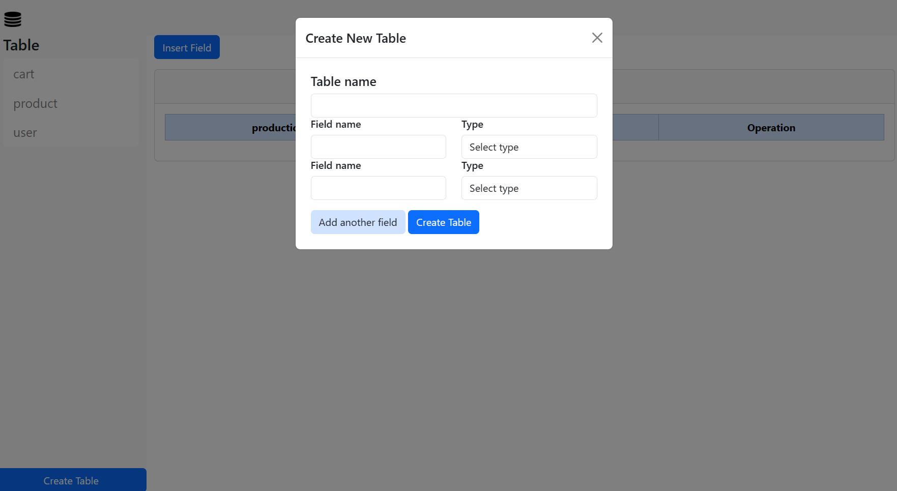
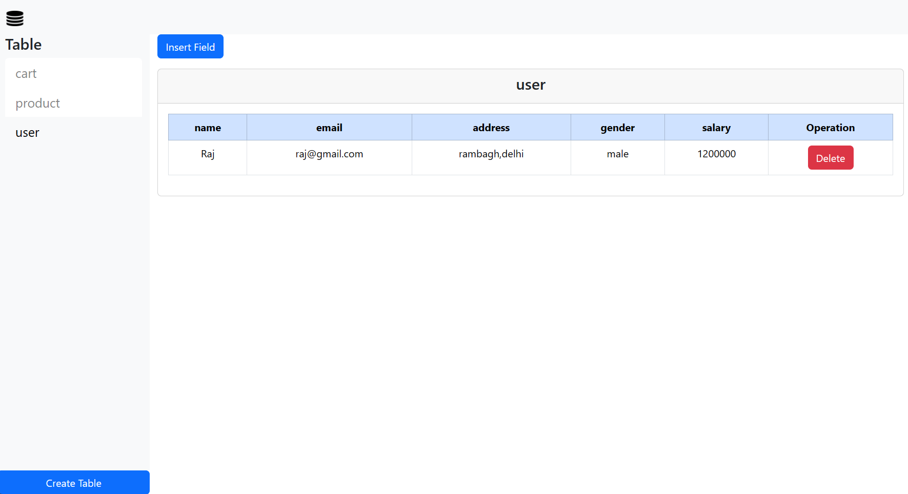
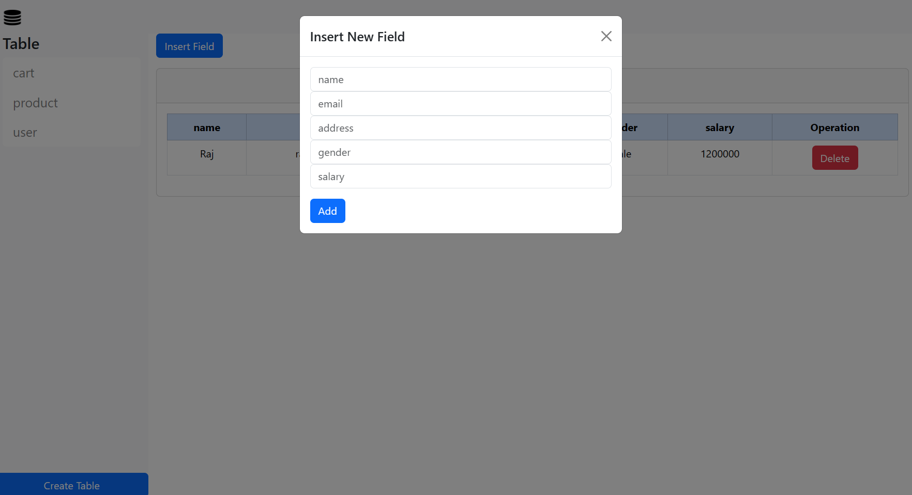

# Database Management System

This project is a Database Management System (DBMS) that allows users to manage various services related to databases. It provides an intuitive and user-friendly interface for interacting with databases and performing various operations.

## Tech Stack

This project is built using the following technologies:

- **Frontend**: HTML, CSS, JavaScript
- **Backend**: Node.js, Express.js
- **Database**: MySQL

## Features

The DBMS provides the following features:

- **Fetch All Tables**: The system can retrieve and display all the tables in the database.

- **Table Data**: When a user clicks on a specific table, the system fetches and displays the data of that particular table.

- **Delete Record**: Within the table data view, users have the option to delete specific data records from the table.

- **Create Table**: Users can create new tables in the database. A modal dialog is provided for this purpose, where users can add field names and their corresponding type to define the structure of the new table.

- **Insert New Field**: Users can also insert new fields into existing tables. A modal dialog is provided for this purpose as well. The dialog presents options with all the fields that are currently in the table.

## Screenshots

## Usage

To use this DBMS, simply navigate through the user interface and select the operation you want to perform (fetch tables, view table data, delete record, create table, or insert new field). Follow the prompts in the modal dialogs to create tables or insert new fields.

## Conclusion

This DBMS is a powerful tool for managing databases. Its user-friendly interface and robust features make it easy for users to perform complex database operations.
